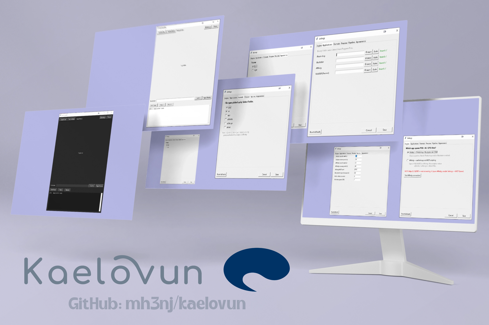

<p align="center">
  <picture>
    <source media="(prefers-color-scheme: dark)" srcset="assets/banner.webp">
    
  </picture>
</p>

<p align="center">
  <strong>Kaelovun</strong>
</p>

<p align="center">
  <strong>Batch-process Adobe files into a searchable, archived asset library.</strong>
</p>

<p align="center">
  <a href="#"></a>
  <a href="#"></a>
  <a href="#"></a>
  <a href="#"></a>
  <a href="#"></a>
  <a href="docs/affinity-setup.md"></a>
  <a href="https://github.com/mh3nj/kaelovun/releases"></a>
  <a href="https://github.com/mh3nj/evoury"></a>
</p>

---

> **Note:** Kaelovun was previously named **Asset Organizer**. The application was rebranded in v1.3.1 with a new name, theme-aware logos, and updated build/release assets. No pipeline behavior changed;existing workflows, archives, and Evoury integration continue as before.

Kaelovun processes PSD, AI, and EPS files one at a time. For each file it exports a preview, asks for a descriptive name, creates an AVIF thumbnail, and packages everything into a verified RAR archive.

Files open in **Adobe** (Photoshop/Illustrator via COM) by default, or in the new unified **Affinity** via its local MCP scripting server;switch anytime in ** Settings → Engine**. Affinity mode additionally handles native `.afphoto`, `.afdesign`, and `.afpub` files. See [docs/affinity-setup.md](docs/affinity-setup.md).

The goal is simple: replace generic filenames like `Logo_Final.ai` with searchable names like `green white black letter logo minimal corporate shadow.ai`. Once files are named this way, any filesystem search tool (Windows Search, Everything, grep) finds them immediately;no database, no tags, no proprietary catalog.

Kaelovun is the ingestion pipeline for [Evoury](https://github.com/mh3nj/evoury), a full-featured digital asset management platform. Evoury provides the catalog and grid interface; Kaelovun prepares the assets for it.

---

## Pipeline

Each asset goes through these stages in order:

| # | Stage | Description |
|---|-------|-------------|
| 1 | Open | Opens the file in Adobe or Affinity (see Engine setting). Closes any previous document first. |
| 2 | Export PNG | Renders a full-resolution preview (Adobe ExtendScript, or Affinity MCP canvas render). |
| 3 | Convert AVIF | Converts the PNG to AVIF. Produces a full preview and a 400×400 thumbnail. |
| 4 | Name prompt | Shows the preview and waits for you to type a name. |
| 5 | Hide layers | Unlocks every layer first, then hides all artwork for a clean archive copy (one locked layer can no longer survive and bloat the file). |
| 6 | Save | Saves the document in Adobe. |
| 7 | Close tab | Closes the document tab. Saves changes, no dialog. |
| 8 | Rename | Renames the source file, AVIF, and thumbnail to the chosen name. |
| 9 | Archive | Creates a best-compression RAR with the source and AVIF inside. |
| 10 | Verify | Tests RAR integrity. |
| 11 | Cleanup | Removes the loose source file. The AVIF stays for indexing. |

The queue is single-threaded. One file is processed completely before the next starts. Only one Adobe document is ever open at a time.

---

## Features

- **One-by-one processing.** Never opens more than one Adobe document at once. Previous document is always closed before the next opens.
- **Adobe or Affinity engine.** Flip between Photoshop/Illustrator and the unified Affinity app in Settings. Affinity previews render from the live canvas over MCP.
- **Unlock-first layer hiding.** Every hide step unlocks all layers (and Illustrator page items; Affinity runs a multi-pass unlock+hide) before hiding, so no random locked-visible layer survives to bloat the archive.
- **Affinity popup handling.** The updater popup is answered with Later and the template/welcome opener is closed automatically on start and before each file;the queue never stalls on them.
- **Regenerate preview.** Edit the document in Adobe while the naming prompt is showing, then click "Regen Preview." The document is saved, re-exported, and the preview updates without breaking the pipeline.
- **Resume failed.** If the app crashes, "Resume Failed" re-queues any incomplete jobs from the last session. Source files of incomplete jobs are always at their original path;they only get renamed after full success.
- **Session persistence.** Progress saves to `data/session.json` after every job. On restart, the app can recover where it left off.
- **Disk space guard.** Won't start if free space drops below the configured minimum. Pauses and waits, or stops if you cancel the queue.
- **Error recovery.** Adobe errors (scratch disk full, out of memory, not responding) trigger an automatic restart and retry.
- **Name history.** Arrow keys cycle through previously used names.
- **Dark/light theme.** Toggle via the Theme button. Your choice persists across restarts.
- **Settings dialog.** Engine, app paths, formats, preview, pipeline, and theme;all in-app, stored machine-local in `data/settings.json`. No `config.py` editing, no rebuild.
- **AVIF with thumbnails.** Every asset gets a full-size AVIF preview and a small `.thumb.avif` for grid views.
- **Verified RAR archives.** Best compression, solid archive, tested after creation.

---

## Screenshots

<p align="center">
  
</p>

---

## Demo

[ezgif-7da49008eeeece4d.webm](https://github.com/user-attachments/assets/aaa31e54-aea4-4035-bcd9-4173104c893c)


---

## Requirements

### Runtime

| Component | Notes |
|-----------|-------|
| **Windows 10+** | COM interop is Windows-only |
| **Adobe Photoshop CS6+** or **Illustrator CS6+** | Default engine: opening, exporting, and layer operations |
| **Affinity** (unified Canva-era app) | Optional engine: needs Settings → MCP Server enabled ([setup](docs/affinity-setup.md)) |
| **WinRAR** (`Rar.exe`) | Required for archive creation |

### Development (running from source)

| Dependency | Version |
|-----------|---------|
| Python | 3.11+ |
| `pywin32` | latest |
| `Pillow` | 10.0+ |
| `pillow-avif-plugin` | latest |

Install dependencies:

```bash
pip install -r requirements.txt
```

---

## Installation

Kaelovun runs on Windows only (it depends on Adobe COM interop). The setup scripts and manual steps below all assume a Windows environment.

### First run: configuration

Every setup path below needs one manual step the first time:

```bash
copy config.example.py config.py
```

`config.example.py` is a template;the app never imports it. It reads `config.py`, so without that copy the app won't start.

You usually don't need to edit anything afterwards: Adobe and WinRAR paths are **auto-detected** from `C:\Program Files`. Only touch `config.py` if you want to force a specific Adobe version or override defaults. `config.py` is gitignored; only ever push `config.example.py`.

### Prebuilt executable (recommended)

Download the latest `Kaelovun-vX.Y.Z.zip` from the [Releases page](https://github.com/mh3nj/kaelovun/releases). Extract the **entire** archive and run `Kaelovun/Kaelovun.exe`. No Python or dependencies required;everything is bundled.

> **Extract everything, keep the folder together.** The exe needs its `_internal/` folder next to it (it holds `python3xx.dll` and the `scripts/` automation). If you move `Kaelovun.exe` out alone, or run it straight from inside the zip without extracting, Windows shows `Failed to load Python DLL ... _internal/python3xx.dll`. Fix: extract the full zip, then run `Kaelovun/Kaelovun.exe` from the extracted folder.

### Run from source with setup script

The repository includes two scripts that create a virtual environment, install dependencies, and launch the app:

**Windows:**
```batch
setup.bat
```

**Linux / macOS** (for development or testing;Adobe COM is Windows-only, so the pipeline itself will not work):
```bash
chmod +x setup.sh
./setup.sh
```

Each script checks for Python 3.11+, creates a `.venv` if one does not exist, installs `requirements.txt`, and runs `main.py`.

### Run from source manually

```bash
# Clone the repository
git clone https://github.com/mh3nj/kaelovun.git
cd kaelovun

# Create and activate a virtual environment
python -m venv .venv
.venv\Scripts\activate

# Install dependencies
pip install -r requirements.txt

# Create config.py from the template (one-time; paths auto-detect)
copy config.example.py config.py

# Launch the application
python main.py
```

### Build a standalone executable

```bash
pip install pyinstaller
python -m PyInstaller Kaelovun.spec --noconfirm
```

The runnable app will be at `dist/Kaelovun/Kaelovun.exe` (with `dist/Kaelovun/_internal/` next to it). It includes all dependencies and the `scripts/` folder containing Adobe ExtendScript files. Or run `scripts/build_release.bat`;it builds from the spec, verifies `_internal/python3*.dll` exists, and zips `dist/Kaelovun` to `Kaelovun-vX.Y.Z.zip` for you.

> **Always build from the `.spec` file.** Running `pyinstaller main.py` regenerates the spec with no data files and silently drops the `scripts/` folder, which makes every job fail with "Missing JSX".

> **Never run `build/Kaelovun/Kaelovun.exe`.** The `build/` folder only holds intermediate files;that exe always fails with `Failed to load Python DLL ... build/Kaelovun/_internal/python3xx.dll` because there is no `_internal/` there. Always run `dist/Kaelovun/Kaelovun.exe`.

---

## Usage

1. Launch the application.
2. Click **Select Folder** and choose a folder containing PSD, AI, or EPS files. Subdirectories are scanned recursively.
3. Click **Start Queue**.
4. For each asset:
   - A preview appears.
   - Type a descriptive name and press Enter or click **Confirm**.
   - Optionally, edit the document in Adobe and click **Regen Preview** before confirming.
5. The app creates a `.rar` archive next to the source file and removes the loose source.

### Controls

| Control | Action |
|---------|--------|
| **Select Folder** | Scan a folder recursively for Adobe source files |
| **Resume Failed** | Re-queue incomplete jobs from the last session |
| **Start Queue** | Begin sequential processing |
| **Pause / Resume** | Pause or resume between jobs |
| **Regen Preview** | Re-export the preview from the currently open document (during naming only) |
| **Confirm** | Accept the typed name and continue |
| **Theme** | Toggle dark and light themes |
| ** Settings** | Engine, app paths, formats, preview, pipeline, theme |

### Regenerating a preview

1. Wait for the naming prompt.
2. Switch to Adobe Photoshop or Illustrator.
3. Make your edits.
4. Switch back to Kaelovun.
5. Click **Regen Preview**.
6. The preview updates. Type the name and continue.

The pipeline stays at the naming step the entire time. Nothing breaks.

### Resuming after a crash

1. Launch Kaelovun.
2. Click **Resume Failed**.
3. Incomplete jobs from the last session are restored.
4. Click **Start Queue** to process them.

Only jobs that never reached "done" are recovered. Jobs whose source file was already deleted are skipped.

---

## Configuration

Prefer the in-app route: ** Settings** writes to `data/settings.json` (gitignored, machine-local) and applies instantly;no restart, no rebuild. `copy config.example.py config.py` is still the one-time first step (the app only reads `config.py`), but you rarely need to open it: Adobe, Affinity, and WinRAR paths auto-detect from `C:\Program Files`.

`config.py` ships the defaults; `data/settings.json` holds your overrides. Delete `settings.json` (or Settings → Reset defaults) to go back to stock.

| Setting | Default | Description |
|---------|---------|-------------|
| `ENGINE` | `adobe` | `adobe` (Photoshop/Illustrator) or `affinity` (unified app via MCP) |
|---------|---------|-------------|
| `PREVIEW_WIDTH` | 2000 | Max preview width in pixels |
| `PREVIEW_HEIGHT` | 2000 | Max preview height in pixels |
| `THUMB_WIDTH` | 400 | Thumbnail width in pixels |
| `THUMB_HEIGHT` | 400 | Thumbnail height in pixels |
| `AVIF_QUALITY` | 90 | AVIF encode quality (0–100) |
| `AVIF_SPEED` | 6 | AVIF encoding speed (0=slowest/best, 10=fastest) |
| `THUMB_QUALITY` | 70 | Thumbnail AVIF quality |
| `MINIMUM_FREE_SPACE_GB` | 1 | Disk space safety threshold |
| `ADOBE_STARTUP_WAIT` | 20 | Seconds to wait for Adobe to launch |
| `ADOBE_RECOVERY_WAIT` | 20 | Seconds to wait after restarting Adobe |
| `DOCUMENT_TIMEOUT` | 60 | Seconds to wait for a document to finish opening |
| `MAX_RETRIES` | 2 | Number of automatic retries on recoverable errors |
| `AFFINITY_MCP_PORT` | 6767 | Local Affinity scripting server port |
| `AFFINITY_STARTUP_WAIT` | 25 | Seconds to wait for Affinity to launch |
| `AFFINITY_RECOVERY_WAIT` | 20 | Seconds to wait after restarting Affinity |
| `AFFINITY_RESTART_EVERY` | 10 | Recycle self-launched Affinity every N files (3.2.1 can't close tabs; 0 = never) |
| `THEME` | `dark` | Startup theme (`dark` or `light`) |

---

## Supported formats

| Format | Open | Export | Hide Layers | Save | Close |
|--------|------|--------|-------------|------|-------|
| `.psd` | ✓ | ✓ | ✓ | ✓ | ✓ |
| `.ai` | ✓ | ✓ | ✓ | ✓ | ✓ |
| `.eps` | ✓ | ✓ | ✓ | ✓ | ✓ |
| `.afphoto` | Affinity-only | ✓ (1024px) | ✓ (artwork) | native-only |;(3.2.1) |
| `.afdesign` | Affinity-only | ✓ (1024px) | ✓ (artwork) | native-only |;(3.2.1) |
| `.afpub` | Affinity-only | ✓ (1024px) | ✓ (artwork) | native-only |;(3.2.1) |
| `.indd` |;|;|;|;|;|

Affinity PSD/AI/EPS rows behave like Adobe except: previews cap at 1024px, hide runs a multi-pass unlock+hide (locked layers included), save-back and tab-close don't exist yet in 3.2.1;see [docs/affinity-setup.md](docs/affinity-setup.md).

---

## Evoury integration

[Evoury](https://github.com/mh3nj/evoury) is a full-featured digital asset management (DAM) platform. It provides an asset grid, catalog browsing, and search across your organized library.

Kaelovun is the ingestion pipeline for Evoury. Together they form a complete workflow:

```
Source files (PSD/AI/EPS)
       │
       ▼
Kaelovun ────→ Organized archives (RAR + AVIF)
(ingestion pipeline)        │
                            ▼
                       Evoury DAM
                   (catalog and management)
```

You can use Kaelovun without Evoury. It produces standard files that work with any file manager or search tool.

---

## Architecture

```
main.py                     Entry point;wires all components
├── config.py               Global configuration (local-only, gitignored)
├── config.example.py       Sanitized config template (push to GitHub)
├── logger.py               File, console, and UI logging
├── requirements_check.py   Environment verification
│
├── pipeline/               Processing pipeline
│   ├── processor.py        Main pipeline orchestrator
│   ├── queue.py            Sequential job queue (single-threaded)
│   ├── job.py              Job model and status enum
│   └── scanner.py          Recursive folder scanning
│
├── adobe/                  Adobe COM integration
│   ├── photoshop.py        Photoshop COM controller
│   ├── illustrator.py      Illustrator COM controller
│   ├── jsx_bridge.py       Loads and executes ExtendScript (.jsx)
│   └── recovery.py         Error classification and recovery
│
├── affinity/               Affinity MCP integration (unified Canva-era app)
│   ├── affinity.py         Affinity controller (open/render/hide/save/close)
│   ├── popups.py           Auto-dismiss updater + template/welcome popups
│   └── mcp_client.py       Stdlib-only MCP client (Streamable HTTP + SSE)
│
├── files/                  File operations
│   ├── app_settings.py     Settings store (data/settings.json overrides)
│   ├── archive.py          RAR creation via Rar.exe
│   ├── cleanup.py          Post-archive source deletion
│   ├── filename.py         Name normalization and deduplication
│   ├── naming.py           Thread-safe name prompt
│   ├── preview.py          PNG to AVIF conversion
│   ├── session.py          Session persistence (data/session.json)
│   └── storage.py          Disk space monitoring
│
├── ui/                     User interface
│   ├── app.py              Tkinter GUI
│   └── settings_dialog.py  Settings dialog (engine/apps/formats/preview/pipeline/theme)
│
└── scripts/                Adobe ExtendScript + Affinity JS automation
    ├── photoshop_export.jsx
    ├── illustrator_export.jsx
    └── affinity_pipeline.js
```

### Threading

| Thread | Responsibility |
|--------|---------------|
| **UI thread** | Tkinter main loop. Polls for name requests and progress every 500ms. |
| **Worker thread** | Runs the queue. Opens Adobe documents, calls COM, blocks on name input. |

Communication uses `threading.Event`. The UI sets the event when a name is submitted or a regeneration is requested. The worker wakes, reads the state, and continues.

### Adobe COM lifecycle

- The Adobe application starts once when the queue begins.
- Before each file, all existing documents are closed.
- One document opens, gets processed, then closes.
- On a recoverable error, the Adobe application restarts.
- When the queue finishes, the application shuts down.

### Affinity MCP lifecycle

- Affinity attaches to your running instance, or launches its own (only self-launched instances are ever quit;yours is left alone).
- Files open via `Affinity.exe <file>`; readiness is confirmed by polling the open document name over MCP.
- Previews render from the live canvas (`render` tool);no filesystem sandbox involved.
- Hide runs a multi-pass unlock+hide script and is best-effort like save/close: a mismatch logs a warning and the job continues with the file as-is.
- Startup popups never stall the queue: the in-app updater is answered with Later and the template/welcome opener is closed automatically.
- The MCP handshake runs once per queue; on recoverable errors Affinity restarts like the Adobe apps.

---

## FAQ

**Can I use this without Evoury?**  
Yes. Kaelovun produces organized RAR and AVIF files that work with any file manager or search tool.

**Does it modify the original files?**  
The source file is renamed and archived into a RAR. After the archive is verified, the loose original is deleted. Keep backups of anything irreplaceable.

**Can I rename assets after they are archived?**  
Not through Kaelovun. You would need to extract the RAR, rename manually, and re-archive.

**Why does EPS sometimes show a save dialog?**  
Illustrator may prompt for EPS export options. See [Known Limitations](issues.md#eps-save-dialog-illustrator) for the workaround.

**Can I process 1000 files at once?**  
One at a time, sequentially. The queue is single-threaded by design because Adobe COM is single-threaded.

**"Failed to load Python DLL ... _internal/python3xx.dll"?**  
You launched the exe without its folder. This happens when you (a) run `build/Kaelovun/Kaelovun.exe` instead of `dist/Kaelovun/Kaelovun.exe`, (b) move `Kaelovun.exe` out of its folder away from `_internal/`, or (c) run it from inside the zip without extracting. Extract the full release zip and run `Kaelovun/Kaelovun.exe` from the extracted folder;never move the exe alone.

---

## Contributing

See [CONTRIBUTING.md](CONTRIBUTING.md) for guidelines.

---

## License

MIT. See [LICENSE](LICENSE) for details.

---

<p align="center">
  <sub>Kaelovun;ingestion pipeline for <a href="https://github.com/mh3nj/evoury">Evoury</a></sub>
</p>
